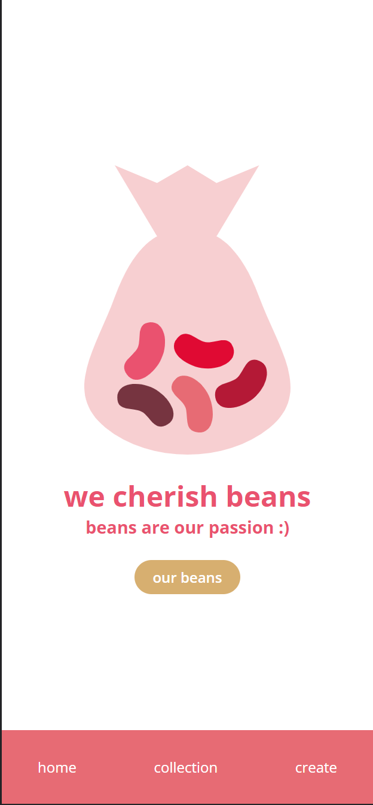
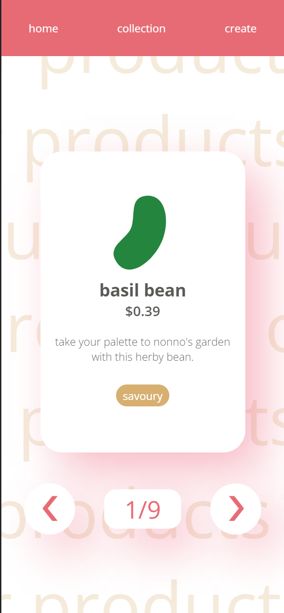
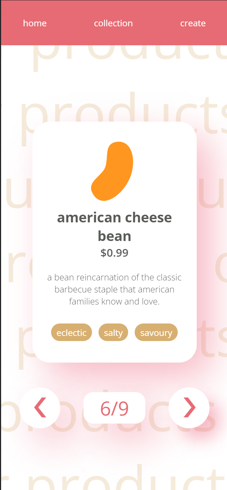
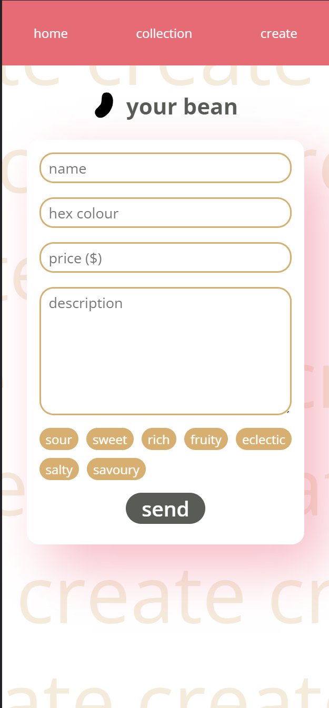

<h1>BeanO</h1>
<h3>Matteo Golin</h3>

A simple full-stack website made to display jelly bean information from a database.

## About
This website allows users to view a simple webpage wherein a selection of jelly beans from an API accessible database
is displayed. The user can also use the form on the "create" page to add their own jelly beans to the collection.

The _on sale_ property of each bean can only be set through the Django administrator page.

## UI Overview

### Home Page
The home page displays the collection logo and shows the navigation menu across the bottom of the screen.

    

### Collection Page
The collection page displays all the beans in the collection through a sliding carousel. Users can navigate left and
right, and see how many of the total beans they've looked through via the display underneath the carousel.

    
    

### Create Page
Users are invited to add their own beans to the collection! Beans require a name, colour, price and a short
description. Users can also add tags to their beans to describe what categories they belong to. Categories are
pre-determined.

Notably, the bean icon next to the text `your bean` changes colour as the user inputs their desired bean colour
in hex format.

    

## Technologies
- HTML
- CSS
- React
- Django
- Django REST Framework

## Notes
Currently, only a mobile view of the website is visible.

Additionally, this application makes use of the hash router because it was a simple fix for the URLs, and routing was
not the main focus of this project.

Finally, the API does have additional functionality not yet used in this project (the ability to fetch single beans' 
data using an ID in the URL, and also a getRoutes URL that shows a list of endpoints). This additional functionality was
added in case I wanted to use it later on.

### Running From Fresh Install/Clone
The project requires `npm install` and `npm build` to be run in the `./frontend` directory. This will create the 
build that will be hosted by Django.

Additionally, a `secretkey.py` containing the Django secret key must be created in `./beanO`. The secret key will be a 
string stored in a variable called `secret_key`.
